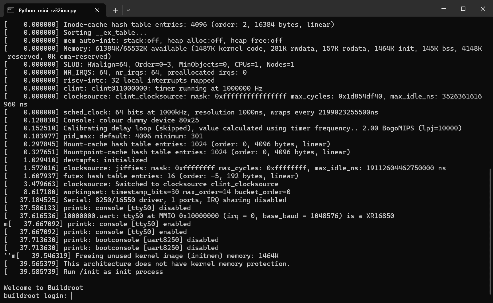

# mini-rv32ima for python
Implements a virtual machine with a processor based on the RISC-V architecture.
Allows you to run Linux OS in Python.

This is source code port of the mini-rv32ima to python
Original source code: https://github.com/cnlohr/mini-rv32ima/tree/master

# Run linux
- Download https://github.com/cnlohr/mini-rv32ima-images/raw/master/images/linux-6.1.14-rv32nommu-cnl-1.zip
- Extract "Image" to directory with mini_rv32ima.py
- Run on terminal:
  > python mini_rv32ima.py
